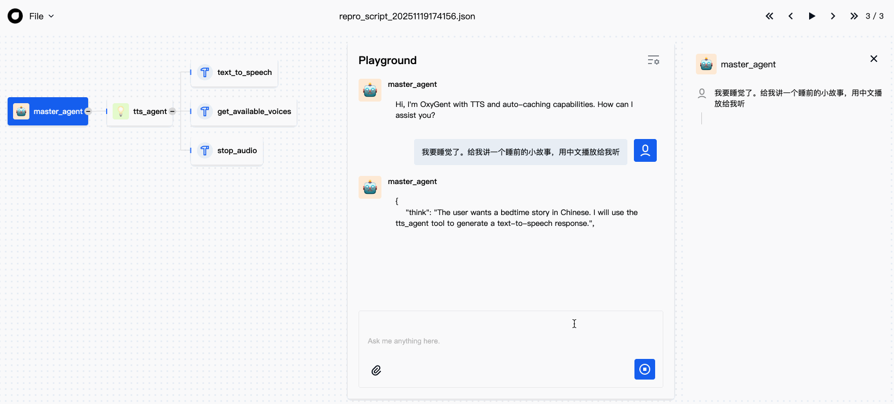

# TTS 工具使用指南

## 概述

TTS (Text-to-Speech) 工具是基于 Microsoft Edge TTS 的文本转语音 MCP 服务，提供高质量的语音合成和播放功能。该工具支持多种语言和声音，具有智能缓存、自动分块处理等高级特性。

## 系统要求

### 支持的操作系统
- ✅ **macOS** (使用 afplay 播放器)
- ✅ **Windows** (使用 PowerShell Media Player)
- ❌ **Linux** (暂不支持)

### 必需依赖
```bash
pip install edge-tts
```

### 可选依赖（增强功能）
```bash
# 用于音频处理和时长检测
pip install pydub

# 用于高质量音频合并（推荐）
# macOS
brew install ffmpeg

# Windows
# 从 https://ffmpeg.org/ 下载安装

# Linux
apt install ffmpeg
```

## 核心功能

### 1. 文本转语音播放 (`text_to_speech`)

将文本转换为语音并自动播放，支持智能缓存和自动分块处理。

**功能特点：**
- 🎵 **自动播放**：生成音频后立即播放
- 💾 **智能缓存**：相同文本和声音组合会被缓存，下次直接播放
- 📦 **自动分块**：长文本自动分块处理（固定 1200 字符/块）
- 🔄 **重试机制**：网络失败时自动重试（最多 3 次）
- 🎯 **智能分割**：优先在句子、逗号等自然断点分割

**参数：**
- `text` (必需): 要转换的文本内容
- `voice` (可选): 声音 ID，默认为 `zh-CN-XiaoxiaoNeural`

**示例：**
```python
# 中文语音
text_to_speech(
    text="你好，欢迎使用 OxyGent TTS 工具",
    voice="zh-CN-XiaoxiaoNeural"
)

# 英文语音
text_to_speech(
    text="Hello, welcome to OxyGent TTS tool",
    voice="en-US-AriaNeural"
)

# 长文本自动分块处理
text_to_speech(
    text="这是一段很长的文本..." * 100,
    voice="zh-CN-YunxiNeural"
)
```

**缓存机制：**
- 缓存目录：`tts_audio_cache/`（在当前工作目录）
- 缓存容量：最多 50 个文件
- 保留时间：7 天（168 小时）
- 缓存索引：`cache_index.json`

### 2. 获取可用声音 (`get_available_voices`)

查询 Edge TTS 支持的所有声音，支持按语言过滤。

**参数：**
- `language_filter` (可选): 语言过滤器，如 `zh`、`en`、`zh-CN`

**示例：**
```python
# 获取所有中文声音
get_available_voices(language_filter="zh")

# 获取所有英文声音
get_available_voices(language_filter="en")

# 获取所有声音
get_available_voices()
```

**常用声音：**

| 语言 | 声音 ID | 描述 | 性别 |
|------|---------|------|------|
| 中文 | `zh-CN-XiaoxiaoNeural` | 晓晓 | 女声 |
| 中文 | `zh-CN-YunxiNeural` | 云希 | 男声 |
| 中文 | `zh-CN-YunyangNeural` | 云扬 | 男声 |
| 中文 | `zh-CN-XiaoyiNeural` | 晓伊 | 女声 |
| 英文 | `en-US-AriaNeural` | Aria | 女声 |
| 英文 | `en-US-GuyNeural` | Guy | 男声 |
| 英文 | `en-US-JennyNeural` | Jenny | 女声 |

### 3. 停止播放 (`stop_audio`)

停止当前正在播放的音频。

**示例：**
```python
stop_audio()
```

## 配置示例

### 基础配置

```python
import os
import sys
import asyncio
from oxygent import MAS, Config, oxy

# 配置默认 LLM
Config.set_agent_llm_model("default_llm")

# 获取项目根目录
PROJECT_ROOT = os.path.dirname(os.path.dirname(os.path.dirname(os.path.abspath(__file__))))
TTS_TOOLS_PATH = os.path.join(PROJECT_ROOT, "mcp_servers", "tts_tools.py")

# 定义 oxy 空间
oxy_space = [
    # LLM 配置
    oxy.HttpLLM(
        name="default_llm",
        api_key="your-api-key",
        base_url="your-llm-endpoint",
        model_name="your-model",
    ),

    # TTS MCP 客户端
    oxy.StdioMCPClient(
        name="tts_tools",
        params={
            "command": sys.executable,  # 使用当前 Python 解释器
            "args": [TTS_TOOLS_PATH],
        },
    ),

    # TTS Agent
    oxy.ReActAgent(
        name="tts_agent",
        desc="文本转语音代理，支持自动缓存和播放",
        tools=["tts_tools"],
        system_prompt="""你是一个文本转语音助手，基于 Microsoft Edge TTS。

你可以使用以下功能：
- text_to_speech(text, voice) - 播放文本语音（自动缓存）
- stop_audio() - 停止当前播放
- get_available_voices(language_filter) - 获取可用声音

当用户想要听到文本朗读时，使用 text_to_speech 函数。""",
        llm_model="default_llm",
    ),

    # 主代理
    oxy.ReActAgent(
        is_master=True,
        name="master_agent",
        sub_agents=["tts_agent"],
        system_prompt="请根据任务选择合适的工具完成任务。",
        llm_model="default_llm",
    ),
]
```

### 启动服务

```python
async def main():
    async with MAS(oxy_space=oxy_space) as mas:
        await mas.start_web_service(
            first_query="你好！我是你的 TTS 助手，可以帮你朗读文本。",
            welcome_message="Hi, I'm OxyGent with TTS capabilities.",
        )

if __name__ == "__main__":
    asyncio.run(main())
```

## 使用场景

### 1. 文档朗读
```python
# 用户请求
"请帮我朗读这段文档：人工智能是计算机科学的一个分支..."

# Agent 会调用
text_to_speech(
    text="人工智能是计算机科学的一个分支...",
    voice="zh-CN-XiaoxiaoNeural"
)
```

### 2. 多语言支持
```python
# 中文
"读这段话：欢迎使用 OxyGent"
# 调用 text_to_speech(text="欢迎使用 OxyGent", voice="zh-CN-XiaoxiaoNeural")

# 英文
"Read this: Welcome to OxyGent"
# 调用 text_to_speech(text="Welcome to OxyGent", voice="en-US-AriaNeural")
```

### 3. 长文本处理
```python
# 自动分块处理长文本
text_to_speech(
    text="这是一篇很长的文章..." * 1000,  # 会自动分成多个 1200 字符的块
    voice="zh-CN-YunxiNeural"
)
```

## 技术细节

### 文本分块策略

对于超过 1200 字符的文本，工具会智能分块：

1. **优先级 1**：在句子结束符（。！？.!?）处分割
2. **优先级 2**：在逗号、分号（，；,;）处分割
3. **优先级 3**：强制按字符数分割

最小块大小：50 字符

### 缓存策略

- **缓存键**：文本内容 + 声音 ID 的 MD5 哈希
- **缓存位置**：`tts_audio_cache/` 目录
- **索引文件**：`cache_index.json`
- **自动清理**：
  - 超过 7 天的缓存自动删除
  - 超过 50 个文件时删除最旧的文件

### 重试机制

- **最大重试次数**：3 次
- **退避策略**：指数退避 + 随机抖动
- **基础延迟**：1 秒
- **最大延迟**：10 秒

### 音频合并

对于分块的长文本：

1. **高质量模式**（需要 ffmpeg）：使用 pydub 合并，添加 200ms 间隔
2. **简单模式**（无 ffmpeg）：二进制直接拼接

## 故障排查

### 1. 依赖检查失败

**错误信息：**
```
❌ edge-tts is not installed
```

**解决方案：**
```bash
pip install edge-tts
```

### 2. 系统不支持

**错误信息：**
```
❌ Unsupported system: Linux
```

**解决方案：**
- 使用 macOS 或 Windows 系统
- Linux 系统暂不支持音频播放

### 3. 播放器未找到

**macOS 错误：**
```
❌ afplay command not found
```

**解决方案：**
- afplay 是 macOS 预装工具，检查系统音频设置
- 重启终端或系统

**Windows 错误：**
```
❌ PowerShell not available
```

**解决方案：**
- PowerShell 是 Windows 10/11 预装工具
- 检查 PowerShell 安装

### 4. 缓存目录权限问题

**错误信息：**
```
❌ Cannot write to cache directory
```

**解决方案：**
```bash
# 检查目录权限
ls -la tts_audio_cache/

# 修改权限
chmod 755 tts_audio_cache/
```

### 5. 网络超时

**错误信息：**
```
Network timeout
```

**解决方案：**
- 检查网络连接
- 工具会自动重试 3 次
- 等待片刻后重试

## 性能优化建议

### 1. 预热缓存
对于常用文本，提前生成缓存：
```python
# 预热常用问候语
text_to_speech("欢迎使用", "zh-CN-XiaoxiaoNeural")
text_to_speech("谢谢使用", "zh-CN-XiaoxiaoNeural")
```

### 2. 安装 ffmpeg
安装 ffmpeg 可以获得更好的音频质量：
```bash
# macOS
brew install ffmpeg

# Windows
# 从 https://ffmpeg.org/ 下载
```

### 3. 合理设置缓存大小
根据使用场景调整缓存参数（在 `tts_tools.py` 中）：
```python
MAX_CACHE_FILES = 50       # 缓存文件数量
CACHE_RETENTION_HOURS = 168 # 保留时间（小时）
```

## 完整示例

查看完整的示例代码：
- 📄 [tts_demo.py](../../examples/mcp_tools/tts_demo.py)

## API 参考

### text_to_speech

```python
def text_to_speech(
    text: str,
    voice: str = "zh-CN-XiaoxiaoNeural"
) -> str
```

**参数：**
- `text`: 要转换的文本
- `voice`: 声音 ID

**返回：**
- 成功：`"Playing cached audio (voice: xxx)"` 或 `"Playing generated audio (voice: xxx)"`
- 失败：错误信息

### get_available_voices

```python
def get_available_voices(
    language_filter: Optional[str] = None
) -> str
```

**参数：**
- `language_filter`: 语言过滤器（可选）

**返回：**
- 可用声音列表（最多显示 20 个）

### stop_audio

```python
def stop_audio() -> str
```

**返回：**
- `"Audio playback stopped successfully"` 或错误信息

## 常见问题

**Q: 为什么不支持 Linux？**
A: 当前版本依赖系统特定的音频播放器（macOS 的 afplay 和 Windows 的 PowerShell），Linux 支持计划在未来版本中添加。

**Q: 缓存文件可以手动删除吗？**
A: 可以。缓存文件存储在 `tts_audio_cache/` 目录中，可以安全删除。工具会自动管理缓存。

**Q: 支持自定义语速和音量吗？**
A: 当前版本暂不支持，但代码中已有相关接口（`apply_audio_effects`），可以扩展实现。

**Q: 如何选择合适的声音？**
A: 使用 `get_available_voices()` 查看所有可用声音，根据语言和性别选择。推荐使用 Neural 系列声音，质量更高。

## 更新日志

### v1.0.0
- ✅ 基础文本转语音功能
- ✅ 智能缓存机制
- ✅ 自动分块处理
- ✅ 重试机制
- ✅ macOS 和 Windows 支持
- ✅ 多语言声音支持

## 许可证

本工具是 OxyGent 项目的一部分，遵循项目许可证。
